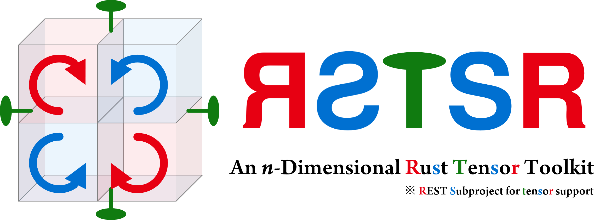

<div align="center">



</div>

# RSTSR: An n-Dimensional Rust Tensor Toolkit

<div align="center">

| Resources | Badges |
|--|--|
| User Document | [](https://rstsr-book.readthedocs.io/latest/) |
| API Document | [](https://docs.rs/rstsr) |
| Crate | [](https://crates.io/crates/rstsr) |

</div>

Welcome to RSTSR, an n-dimensional tensor toolkit library, in native rust.

This crate will be a building block for scientific computation in native Rust, similar to NumPy of Python.

For users comes from NumPy, the [NumPy-RSTSR Cheatsheet](https://restgroup.github.io/rstsr-book/docs/numpy-cheatsheet) ([简体中文](https://restgroup.github.io/rstsr-book/zh-hans/docs/numpy-cheatsheet)) will let you quickly be familiar with RSTSR.

**This project is still in early stage, and radical code factorization could occur; dev-documentation can still be greatly improved.**

## Features

- Simple syntex (looks like NumPy, and some core concepts from rust crate [ndarray](https://github.com/rust-ndarray/ndarray/)).
- % (remainder) as matrix multiplication (you can `&a % &b` to perform `a.matmul(&b)`).
- Allow different devices in framework.
    - We will try to support CUDA and HIP in near future.
- Full support of n-dimensional, broadcasting, basic slicing, reshape.
- Fast on multi-threading CPU.
    - Matmul is provided by backends (such as [faer](https://github.com/sarah-quinones/faer-rs/) or [OpenBLAS](https://github.com/OpenMathLib/OpenBLAS/)).
    - Other cases (summation, element-wise operations) are on-par or even much faster than NumPy (by fast layout iterators and [rayon](https://github.com/rayon-rs/rayon/) threading).
- Either row-major or column-major is supported (controled by cargo feature). Dynamic row/col-major control can also be performed by device setting.

| Supported devices (backends) | Device type name | Crate | Cargo feature |
|--|--|--|--|
| Naive Serial CPU | `DeviceCpuSerial` | rstsr-core | (always built) |
| Faer | `DeviceFaer` | rstsr-core | `rstsr/faer` |
| OpenBLAS | `DeviceOpenBLAS` | rstsr-openblas | `rstsr/openblas` |
| oneAPI MKL | `DeviceMKL` | rstsr-mkl | `rstsr/mkl` |
| BLIS/FLAME | `DeviceBLIS` | rstsr-blis | `rstsr/blis` |
| AOCL | `DeviceAOCL` | rstsr-aocl | `rstsr/aocl` |
| KML | `DeviceKML` | rstsr-kml | `rstsr/kml` |

## Illustrative Example

To start with, you may try to run the following code:

```rust
use rstsr::prelude::*;

// 3x2 matrix with c-contiguous memory layout
let a = rt::asarray((vec![6., 2., 7., 4., 8., 5.], [3, 2].c()));

// 2x4x3 matrix by arange and reshaping
let b = rt::arange(24.);
let b = b.reshape((-1, 4, 3));
// in one line, you can also
// let b = rt::arange(24.).into_shape((-1, 4, 3));

// broadcasted matrix multiplication
let c = &b % &a;

// print the result
println!("{:6.1}", c);
// output:
// [[[   23.0   14.0]
//   [   86.0   47.0]
//   [  149.0   80.0]
//   [  212.0  113.0]]
//
//  [[  275.0  146.0]
//   [  338.0  179.0]
//   [  401.0  212.0]
//   [  464.0  245.0]]]

// print layout of the result
println!("{:?}", c.layout());
// output:
// 3-Dim (dyn), contiguous: Cc
// shape: [2, 4, 2], stride: [8, 2, 1], offset: 0
```

## Short FAQs

> **Why RSTSR? There seems many numeric and machine-learning libraries in rust already.**

We need a numeric library that supports
- a data structure that supports arbitary types (including complex, half, and arbitary-precision)
- a framework that supports different backends
- fast, at least efficient on server CPU
- supports parallel by threading (specifically rayon)
- large dynamic dimension tensor and its reshape
- functionality can be extended by other crates

And further more,
- the framework may not overwhelm chemist scientists

Many crates in native rust done well in some aspects but not all.

This crate gets inspire from [NumPy](https://github.com/data-apis/array-api/), [Array API standard](https://github.com/data-apis/array-api/), [ndarray](https://github.com/rust-ndarray/ndarray/), [candle](https://github.com/huggingface/candle), [Burn](https://github.com/tracel-ai/burn).

> **What is supposed to be supported in near future?**

- Plugins: Einstein summation, FFT
- GPU devices: CUDA and HIP device support
- `rstsr-sci-traits`: Optimization, ODE, special functions
- `rstsr-core`: Full support of [Python array API standard](https://data-apis.org/array-api/latest/) (in native rust instead of python binding)
    - searching functions
    - manuplication functions (tile, roll, moveaxis)

> **What's RSTSR meaning?**

RSTSR either refers to
- its relationship with [REST](https://gitee.com/restgroup/rest): **R**EST (rust-based electronic structure toolkit) **S**ubproject for **T**en**s**o**r** support, or
- the functionality itself: an *n*-dimensional **R**u**s**t **T**en**s**o**r** toolkit.

This crate was originally trying to developed a more dev-friendly experience for chemist programmer from numpy/scipy/pytorch. However, scientists and engineers from any discipline are welcomed to try this tensor toolkit.

> **Is there an illustrative project for using RSTSR in real-world project?**

We refer a project that developed before rstsr v0.1: [showcase of RI-CCSD](https://github.com/ajz34/showcase_rust_riccsd).
File [riccsd.rs](https://github.com/ajz34/showcase_rust_riccsd/blob/master/src/riccsd.rs) is a demonstration of code style to use RSTSR.

> 如果您能阅读简体中文，[REST Workshop：Rust 计算化学程序开发演示](https://github.com/RESTGroup/showcase-workshop-rstsr-ricc) 是更加完整的实战项目。它表明 RSTSR 在开发电子结构程序时，兼备开发效率与运行效率。该项目也可以作为 RSTSR 的代码风格展示。

> **What features will not be implemented?**

We do not support autodiff and lazy-evaluation in far future. In this mean time, we are not very concern on machine-learning applications, but focus more on traditional scientific computing, especially applications in electronic structure.

## Acknowledge

This is a subproject of [REST](https://gitee.com/restgroup/rest). REST is supported by 
- NSFC (National Natural Science Foundation of China): 22125301, 22393911, 22393912, 22321003, 22233002;
- Innovation Program for Quantum Science and Technology: 2021ZD0303305;
- robotic AI-Scientist platform of Chinese Academy of Science.

Additionally, RSTSR is also funded by
- NSFC (National Natural Science Foundation of China): 22503020.

## Miscellaneous

Current MSRV (minimal supported rust version) is
- 1.84.1: with crate faer built;
- 1.82.0: other cases (due to crate `half` and rust language usage of `unsafe extern "C"`).

You are welcomed to raise problems or suggestions in github repo issues or discussions.
